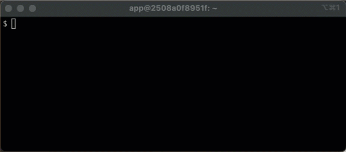

# bq-loader 

bq-loader connects to a variety of upstream data providers to collect market data. It persists this data in CSV files
that reside on the filesystem or S3.

If stored in S3 the resulting files can be easily loaded into DuckDB or another database system for processing.

Logic is built into bq-loader such that it can be run periodically to keep the market data up-to-date.

*NOTE:* This is intended for daily market data only. While we may support hourly or near real-time feeds in the future, this 
is not a priority.

## Approach

Collecting managing multiple data feeds can be a pain. Market data providers can be expensive and/or impose strict rate limits on their APIs.  They also tend to
provide the data in paged API JSON formats that require some transformation to be useful.

We use a simple approach of aggregating data in S3 in drop-dead-simple CSV files so that it can be efficiently and reliably loaded from anywhere (locally, AWS Lambda, cloud compute, etc.)

There is no need to pay for or maintain a persistent database when S3 storage is nearly free.

While modern scale-to-zero RDBMS platforms like [CockroachDB](https://www.cockroachlabs.com/) and [Neon.tech](https://neon.tech/) are very cool and work
reasonably well, I've found that [DuckDB](https://duckdb.org/) with S3 is much easier to work with for performing ad-hoc analysis. 

The primary focus is daily (not-intraday) data, so all we really need is for `bq-loader` to wake up once a day and process

## Usage

### Fileystem

The following invocation will acquire data for `BTC` and `DOGE` and persist the data in the local `./data` directory.  

```shell
docker run -it -e SYMBOLS="X:BTC X:DOGE" -v ./data:/app/data  ghcr.io/bitquant-initiative/bq-loader
```
Note the symbol
prefix of `X:` which is used to indicate that these are crypto symbols to avoid comflicts with stocks indexes and other indicators:

After bq-loader has run, the CSV files are available in the data directory:

```bash
$ find ./data -type f
./data/X_DOGE.csv
./data/X_BTC.csv
```

The format has basic OHLCV structure that can be easily loaded into DuckDB:

```bash
duckdb -s "select * from './data/X_BTC.csv' limit 4"
┌────────────┬────────┬────────┬────────┬────────┬───────────────┐
│    date    │  open  │  high  │  low   │ close  │    volume     │
│    date    │ double │ double │ double │ double │    double     │
├────────────┼────────┼────────┼────────┼────────┼───────────────┤
│ 2015-07-20 │ 277.98 │  280.0 │ 277.37 │  280.0 │  782.88341959 │
│ 2015-07-21 │ 279.96 │ 281.27 │ 276.85 │ 277.32 │ 4943.55943437 │
│ 2015-07-22 │ 277.33 │ 278.54 │ 275.01 │ 277.89 │ 4687.90938331 │
│ 2015-07-23 │ 277.96 │ 279.75 │ 276.28 │ 277.39 │ 5306.91957531 │
└────────────┴────────┴────────┴────────┴────────┴───────────────┘
```

### S3

```
docker run -it \
-e SYMBOLS="X:BTC X:DOGE" \
-e TABLE_STORE_URL="s3://mybucket/data" \
-e AWS_ACCESS_KEY_ID \
-e AWS_SECRET_ACCESS_KEY \
-e AWS_DEFAULT_REGION \
-v ./data:/app/data \
ghcr.io/bitquant-initiative/bq-loader
```

If you are running locally, it might be easier to map your credentials:

```
docker run -it \
-e SYMBOLS="X:BTC X:DOGE" \
-v ${HOME}/.aws:/app/.aws \
-v ./data:/app/data \
ghcr.io/bitquant-initiative/bq-loader
```


....

## Data Providers

Currently 2 data providers are supported: 

* [coinbase](https://docs.cdp.coinbase.com/) - for crypto asset data. API key NOT required.
* [polygon](https://polygon.io) - for stock and index data.  Requires API key.

Currently bq-loader will send all queries for crypto assets (those with `X:` prefix) to coinbase.

Stock and index requests (`S:` and `I:` prefixes) are sent to polygon.

In the future we may make this more flexible so that data can be patched together from any number of sources.

## Naming Conventions

Internally, we use the the convention of `S:`,`I:` and `X:` prefixes to disamiguate stock, index, and crypto symbols.
Symbols are always in UPPER CASE.
This convention was adopted from polygon. Since databases don't like special characters, we change the `:` to `_` for
file, table and column names. The following makes this clear:

| Type | Prefix | Example Ticker | Table Name | CSV Name |
|-----|-----|------|-----|------|
| Stock | S: | MSFT | S_MSFT | S_MSFT.csv |
| Index | I: | NDX | I_NDX | I_NDX.csv |
| Crypto | X: | BTC | X_BTC | X_NDX.csv |

